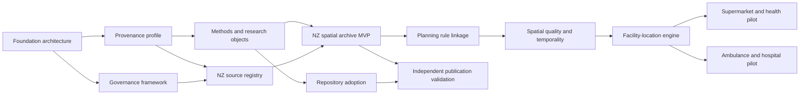

# RIOPA Infrastructure Programme Plan

## Mission

Build an open, modular, provenance-first research infrastructure that converts heterogeneous public and appropriately governed data into citable, reproducible research objects and decision analyses, beginning with a temporally versioned New Zealand spatial and planning archive.

## Programme principles

1. **Federated, not monolithic.** Repositories retain clear source, archive, domain and analytical responsibilities.
2. **Evidence before convenience.** Raw objects, events, schemas, code identity and signed manifests are authoritative; databases and indexes are rebuildable projections.
3. **Additive adoption.** Existing provenance and outputs remain available while common contracts are dual-emitted and validated.
4. **Rights are data.** Licence, attribution, redistribution, privacy, ethics and Māori data sovereignty decisions travel with every source and release.
5. **No false precision.** Temporal, geographic, legal and entity-resolution uncertainty is represented explicitly.
6. **Methods from facts.** Publication text is generated from machine-readable release evidence and reports missing evidence rather than guessing.
7. **Optimisation remains inspectable.** Objectives, constraints, weights, uncertainty and policy value judgements are separately encoded.

## Release sequence

### Architecture bundle `v0.1`

**Purpose:** establish the programme contract and executable roadmap.

**Release gate**

- Conductor product, design, workflow, requirements and tracks are complete.
- ADRs define source of truth, event log, materialisations, bitemporal model, graph projection, standards and governance.
- Candidate JSON Schemas and a valid synthetic research object are published.
- GitHub bootstrap performs a dry run and its issue graph is internally consistent.
- Representative ecosystem gaps and adoption targets are documented.

### Provenance profile candidate `v0.2`

**Purpose:** prove the common profile against native evidence.

**Release gate**

- Exact/approximate/unmapped field mappings exist for `fyi-cli` and `fyi-archive`.
- Rust and Python validate the same golden fixtures.
- Tampering, missing parent evidence, invalid rights states and stale schema versions fail CI.
- One capture-to-release chain can be queried end to end.
- Profile migration and compatibility rules are versioned.

### Research-object release candidate `v0.3`

**Purpose:** make methods, citation and independent review routine.

**Release gate**

- RO-Crate 1.3 and Workflow Run RO-Crate projections validate externally.
- DataCite-ready metadata, rights inventory, quality summary, checksums, SBOM and attestations are emitted.
- A clean environment rebuild is compared and recorded.
- Generated short methods, full supplement and machine-readable facts agree.

### NZ spatial registry `v0.4`

**Purpose:** make authoritative-source discovery and rights/status assessment national and versioned.

**Release gate**

- All current local/regional authorities have a source-registry record, even when no reusable service is found.
- LINZ, Stats NZ, MfE/planning standards, Gazette and legislation source families are registered.
- Service definitions, layer/document inventories, source update evidence and rights classifications are preserved.
- Māori data sovereignty and controlled/public-data pathways have named review gates.

### NZ spatial archive MVP `v0.5`

**Purpose:** demonstrate complete evidence-to-publication flow on heterogeneous councils.

**Release gate**

- At least four deliberately heterogeneous council mechanisms are captured.
- Raw service/document evidence, canonical bitemporal features, rule links and quality evidence are present.
- GeoParquet and DuckDB Spatial materialisations are rebuildable from a named snapshot.
- The release states whether spatial layers are statutory, informational or unresolved based on source evidence.
- A DOI-ready research object and methods supplement are generated.

### Planning and temporal expansion `v0.6`

**Purpose:** support historical and legal-policy analyses.

**Release gate**

- Stable plan/provision identifiers and spatial-to-rule links are validated.
- Proposed, operative, partly operative, appeal and superseded states can be represented without collapsing them.
- Prospective change capture and reconstructed historical evidence are distinguishable.
- Cross-council harmonisation retains original classes and mapping evidence.

### Decision analytics candidate `v0.7`

**Purpose:** provide domain-neutral accessibility and location-allocation capability.

**Release gate**

- Network/travel-time inputs are separately versioned.
- p-median, p-center, set covering, maximal covering and capacitated models share one problem contract.
- Equity, robustness and multi-objective variants expose all weights and constraints.
- Solutions carry solver, tolerance, seed, optimality/bound and feasibility evidence.
- Simulation is used where queueing, dispatch or congestion invalidates a static model.

### Applied pilots `v0.8–v0.9`

**Supermarket/health pilot gate**

- Facility assertions preserve source and reconciliation evidence.
- Feasible sites are derived from sourced planning rules rather than a generic commercial-zone assumption.
- Access, competition/capacity, deprivation and health-outcome analyses state ecological and causal limitations.
- Descriptive, counterfactual and prescriptive outputs are kept distinct.

**Ambulance/hospital pilot gate**

- Dispatch/queueing simulation complements coverage/location models.
- Demand, fleet, station, hospital capacity and travel-time assumptions are versioned.
- Average, tail/worst-case, rurality and equity objectives are reported separately.
- Sensitive or operationally risky data are not pushed through the public-data architecture.

### Stable programme `v1.0`

**Purpose:** publish a supported, independently reproducible infrastructure and reference implementation.

**Release gate**

- Profile and schemas have compatibility guarantees.
- At least three existing repositories meet A1, two meet A3, and one release meets A4 independent reproduction.
- NZ spatial archive has documented national coverage status and stable update operations.
- Citation, governance, security, preservation and deprecation policies are active.
- Infrastructure, data-descriptor and applied-study manuscripts have release-linked evidence packages.

## Workstreams and ownership boundaries

| Workstream | Primary outputs | Must remain separate from |
|---|---|---|
| Shared profile | schemas, event semantics, validators, adapters, mappings | source-specific networking and scientific interpretation |
| Research objects | methods, citation, RO-Crate, metadata, attestations | undocumented editorial claims |
| Source registry | authority, service, document, access and rights records | canonical transformation logic |
| NZ spatial archive | raw preservation, canonical bitemporal model, snapshots | applied causal claims |
| Planning linkage | plan/provision identity, zone/overlay links and mappings | unsupported national equivalence claims |
| Quality/governance | metrics, evidence, waivers, rights and review decisions | silent overrides |
| Decision analytics | problem/solution contracts, solvers, simulation adapters | hidden policy weights |
| Applied research | research questions, outcomes, interpretation and manuscripts | mutation of infrastructure evidence |

## Critical path

## First execution wave

1. Ratify ADRs and normative terms.
2. Produce exact field mappings for `fyi-cli` and `fyi-archive`.
3. Harden schemas with negative fixtures and chain/manifest integrity validation.
4. Complete full methods/research-object projections and external validators.
5. Run dual output through one archive release.
6. Inventory every NZ council source mechanism and rights/status statement.
7. Select four heterogeneous councils only after the inventory.
8. Publish the first complete council spatial/rule research object.

## Publication portfolio

| Output | Evidence package |
|---|---|
| Infrastructure/methods paper | profile, schemas, cross-language fixtures, mappings, clean-room reproduction |
| NZ spatial data descriptor | national source registry, archive manifest, quality/coverage report, DOI snapshot |
| Planning/zoning methods paper | spatial-to-rule identity model, bitemporal reconstruction and validation |
| Supermarket health-geography study | facility registry, zoning feasibility, access models, outcomes and uncertainty |
| Ambulance/hospital planning study | optimisation/simulation specification, scenarios, equity metrics and sensitivity analyses |

Every paper cites immutable releases rather than a moving default branch. Software, schema, dataset and research-object versions remain independent and explicitly related.

## Definition of done for any track

A track is complete only when:

- acceptance criteria pass;
- machine-readable evidence is linked in the track index;
- tests cover successful and failing cases;
- rights/governance implications are reviewed;
- migration and compatibility implications are documented;
- user-facing methods/citation text is regenerated;
- the relevant release or snapshot is immutable and identifiable;
- remaining limitations are recorded as issues or ratchets, not hidden in prose.
