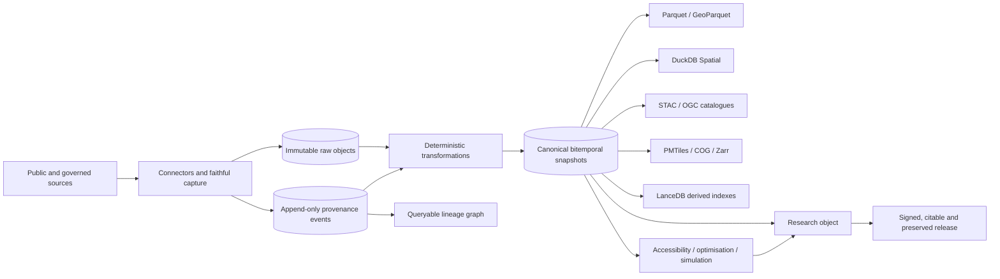

# RIOPA Infrastructure

> Open, modular, provenance-first infrastructure for reproducible public-data research and decision analytics in Aotearoa New Zealand.

**Roadmap bundle:** `0.2.0` — 19 July 2026  
**Current programme maturity:** M1, specified prototype  
**Destination:** M6, stable and supported v1.0

RIOPA Infrastructure is a federated research-infrastructure programme. It preserves raw source evidence, acquisition and transformation lineage, rights and quality decisions, temporal state, analytical specifications and computational environments so that public-data research can be cited, reproduced, corrected and extended.

The first complete reference implementation is a New Zealand spatial and planning archive linking council zoning and plan provisions with facilities, population, accessibility and health-related analyses. Supermarket access is the first applied use case; ambulance and hospital facility planning are additional decision-model validations.

## What this bundle delivers

- A **seven-level M0–M6 maturity model** across 12 independent dimensions.
- A **nine-release train** from the present roadmap architecture through stable v1.0.
- **28 dependency-linked Conductor tracks**, each with specification, phased plan, metadata and evidence index.
- A machine-readable **stable-v1 gate** covering defects, waivers, independent reproduction, external users, operational cycles, release-candidate soak and release authority.
- Executable roadmap validation, evidence-aware readiness reporting and deterministic generation of 141 programme issues plus 10 cross-repository adoption issues.
- The existing provenance, schema validation, methods generation and research-object reference implementation.
- Detailed plans for national spatial/planning capture, facility reconciliation, accessibility, optimisation, simulation, health methods, security, performance, preservation, interoperability, documentation and support.

The local 0.2.0 evidence record passes its four M1 roadmap gates; all later releases remain blocked by unimplemented capabilities and absent qualification evidence. This repository does **not** claim that those planned systems or their stable-release evidence already exist. The current software is a tested provenance and roadmap foundation for building them.

## Stable-v1 invariant

A feature-complete prototype is not v1.0. Stable v1 requires all 28 tracks to reach M6 and blocking evidence across:

1. governance;
2. contracts;
3. provenance;
4. security;
5. data quality and temporality;
6. operations and preservation;
7. performance and scalability;
8. interoperability;
9. publication and citation;
10. usability and support;
11. analytical validity;
12. scientific validity.

See [`PROGRAMME_PLAN.md`](PROGRAMME_PLAN.md), [`conductor/tracks.md`](conductor/tracks.md) and [`docs/v1-definition-of-done.md`](docs/v1-definition-of-done.md).

## Architectural invariant

Raw evidence and append-only provenance are authoritative. Canonical state and every physical representation are versioned projections.



## Development handoff bootstrap

The Codex handoff includes a Git worktree, a full recovery bundle, persistent repository instructions in [`AGENTS.md`](AGENTS.md), and an autonomous execution brief in [`CODEX_AUTONOMOUS_IMPLEMENTATION.md`](CODEX_AUTONOMOUS_IMPLEMENTATION.md). Start with [`START_HERE.md`](START_HERE.md) or run:

```bash
bash scripts/bootstrap_codex_handoff.sh --apply --clone-missing
```

The bootstrap verifies/restores history, discovers related clones by normalised remote URL, creates or reconciles the GitHub repository, wires and safely pushes `origin`, activates the configured Project and issue graph, then generates the next implementation packet. Current development qualification and known gaps are recorded in [`HANDOFF_STATUS.md`](HANDOFF_STATUS.md).

## Quick start

```bash
uv sync --extra dev --frozen

# Validate the current data/provenance example.
uv run riopa validate --root .

# Validate the maturity model, 28 tracks, release gates and generated issue graph.
uv run riopa roadmap validate --root .

# Report readiness for every release or stable v1 only.
uv run riopa roadmap status --root .
uv run riopa roadmap status --root . --release 1.0.0

# Regenerate project/issues.yaml deterministically from Conductor tracks.
uv run riopa roadmap generate-issues --root .

# Run all tests and quality checks.
uv run ruff check .
uv run ruff format --check .
uv run pytest --cov=riopa_provenance --cov-branch
```

Build the synthetic research object:

```bash
uv run riopa research-object \
  --manifest examples/minimal/snapshot-manifest.json \
  --output-dir dist/example-research-object
(cd dist/example-research-object && sha256sum --check checksums.sha256)
```

## Release train

| Release | Maturity | Outcome |
|---|---:|---|
| 0.2.0 | M1 | Executable stable-v1 roadmap and evidence model |
| 0.3.0 | M2 | Normative core alpha |
| 0.4.0 | M2 | Real capture-to-research-object vertical slice |
| 0.5.0 | M3 | New Zealand spatial archive alpha |
| 0.6.0 | M3 | Queryable access/planning/facility beta |
| 0.7.0 | M4 | Hardened temporal and facility-location beta |
| 0.8.0 | M4 | Operational archive, simulations and applied pilots |
| 0.9.0 | M5 | V1 release candidate and full qualification |
| 1.0.0 | M6 | Stable, supported, signed and preserved GA |

## Repository map

```text
conductor/       Product context, maturity/release contracts and 28 tracks
programme/       Publication mirrors of machine-readable programme contracts
schemas/         Provenance, roadmap, maturity, evidence and v1-gate schemas
src/             Reference provenance and roadmap library/CLI
scripts/         Validation, publication and GitHub bootstrap automation
project/         Labels, Project fields and deterministic issue graph
examples/        Synthetic end-to-end provenance/research-object example
docs/            Architecture, standards, operations and v1 policies
reviews/         Existing-ecosystem audit and gap analysis
```

## GitHub bootstrap

After creating a local Git repository and authenticating GitHub CLI with repository and Project scopes:

```bash
bash scripts/bootstrap_github.sh \
  --owner edithatogo \
  --repo riopa-infrastructure \
  --visibility public \
  --create-project \
  --create-issues \
  --cross-repo \
  --mirror-umbrella \
  --apply
```

Run without `--apply` for a non-writing preview. The issue graph is generated from Conductor files and checked for drift in CI. Remote GitHub resources are not claimed to exist until the applied bootstrap records them.

## Design boundaries

- Multiple formats improve usability; none becomes an undocumented second source of truth.
- LanceDB is a derived vector/semantic index, not the authoritative store for geometry or legal state.
- Facility optimisation and MCDA remain explicit and inspectable; value judgements are not hidden in opaque scores.
- A planning GIS layer is not declared legally authoritative unless the source supports that status.
- Feature- or row-level lineage is claimed only when identifiers and transformations justify it.
- The supermarket, ambulance and hospital pilots are research references, not legal, clinical or operational decision systems.
- Open access does not override licensing, privacy, ethics, Māori rights or Māori data sovereignty.

## Licence

Code and original documentation in this repository are MIT licensed. Source datasets retain their own licences, terms and restrictions. No connector or publication process may silently broaden source reuse rights.
