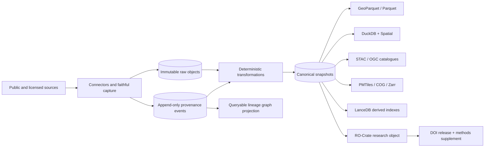

# RIOPA Infrastructure

> Open, modular, provenance-first infrastructure for reproducible public-data research and decision analytics in Aotearoa New Zealand.

**Status:** executable architecture bundle, version `0.1.0` (18 July 2026).  
**Working repository name:** `edithatogo/riopa-infrastructure`.

RIOPA Infrastructure turns heterogeneous public data into versioned, citable research objects while preserving the raw evidence, legal and licensing context, transformation history, quality evidence, and computational environment required to reproduce a result. The planned first full reference implementation is a national spatial archive linking council planning zones and rules to facilities, population, accessibility, and health outcomes.

## What this repository creates

1. A shared provenance and transformation profile for connector, archive, corpus, and analytics repositories.
2. A Conductor-managed implementation programme with tracks, acceptance criteria, dependencies, and GitHub issue definitions.
3. An executable New Zealand Spatial Archive implementation plan covering authoritative national sources, council plan layers, plan text, and temporally versioned links between them.
4. Reusable research-object, methods-supplement, quality, citation, and release contracts, with a working synthetic reference bundle.
5. Specifications and tracks for a domain-agnostic facility-location engine, followed by supermarket/health and emergency/health-facility pilots.

## Architectural invariant

Raw evidence and append-only provenance events are authoritative. Canonical datasets and all physical formats are deterministic projections.



The graph, DuckDB database, search indexes, web tiles, and publication bundles can always be rebuilt from immutable inputs, versioned code, declared parameters, and the event stream.

## Quick start

```bash
uv sync --extra dev --frozen
uv run riopa validate --root .
uv run pytest -q
uv run riopa methods \
  --manifest examples/minimal/snapshot-manifest.json \
  --output examples/minimal/METHODS.md
uv run riopa research-object \
  --manifest examples/minimal/snapshot-manifest.json \
  --output-dir dist/example-research-object
(cd dist/example-research-object && sha256sum --check checksums.sha256)
```

Create the GitHub repository, roadmap project, labels, parent issues, sub-issues, and dependencies from a local checkout:

```bash
bash scripts/bootstrap_github.sh \
  --owner edithatogo \
  --repo riopa-infrastructure \
  --visibility public \
  --create-project \
  --create-issues \
  --cross-repo \
  --mirror-umbrella \
  --apply
```

The bootstrap is idempotent by issue key and title. It creates or reuses the repository, repository Roadmap project, custom fields, programme epic, 13 track parents, phase sub-issues, dependency links, eight targeted cross-repository adoption issues, and selected links into the existing RIOPA umbrella project. It requires authenticated GitHub CLI access with `repo` and `project` scopes. Run the same command without `--apply` for a non-writing preview. Saved project views are listed in `project/project.yaml` and remain a deliberate manual GitHub UI step because the current project automation surface cannot create them.

## Layer model

| Layer | Purpose | Mutation rule |
|---|---|---|
| L0 source evidence | Original downloads, API responses, service definitions, documents, WARC/WACZ where appropriate | Append only |
| L1 canonical | Harmonised entities, geometries, legal provisions, stable identifiers, bitemporal state | Rebuilt, versioned snapshots |
| L2 materialisations | GeoParquet, DuckDB, STAC, PMTiles, COG/Zarr, optional PostGIS and LanceDB | Disposable and reproducible |
| L3 analytical products | Accessibility, coverage, facility-location solutions, uncertainty and equity metrics | Versioned by model specification |
| L4 research objects | RO-Crate, metadata, methods, quality report, checksums, attestations, citation | Immutable release |

## First reference implementation

The New Zealand Spatial Archive will begin with:

- LINZ addresses, roads, property, place names, elevation and imagery metadata;
- Stats NZ geographic boundaries and open area-level population data;
- council district-plan zones, overlays, precincts, designations, and service metadata;
- district-plan text and stable provision identifiers;
- Gazette notices and other evidence for legal status and effective dates;
- a facility registry pilot for supermarkets and health services;
- temporal snapshots that distinguish publication, retrieval, legal validity, and replacement times.

The archive will not imply that a council GIS layer is legally authoritative unless its source states that. Spatial layers and plan text remain linked but separately evidenced.

## Standards profile

The core profile combines, rather than replaces, established standards:

- W3C PROV-O for semantic lineage;
- OpenLineage-compatible run events for operational interoperability;
- RO-Crate 1.3 and Workflow Run RO-Crate profiles for research-object packaging;
- in-toto and SLSA provenance for build and release integrity;
- DataCite 4.7, DCAT 3, Croissant and Frictionless metadata for discovery and citation;
- GeoParquet, STAC, OGC API Features/Records, ISO 19157-1 and DQV for geospatial interoperability and quality.

See [`docs/standards-profile.md`](docs/standards-profile.md).

## Repository map

```text
conductor/       Programme context and executable tracks
schemas/         Machine-readable source, lineage, snapshot, quality and spatial contracts
src/             Minimal reference library and CLI
scripts/         Validation, methods/research-object generation and GitHub bootstrap
project/         Labels, project configuration and issue graph
examples/        Valid end-to-end research-object example
reviews/         Evidence-backed audit of existing repositories
```

## Design boundaries

- Multiple formats increase usability; none becomes an undocumented second source of truth.
- LanceDB is a derived semantic/vector index, not the primary store for geometry or legal state.
- Knowledge graphs are query projections, not required operational infrastructure for the MVP.
- Artifact-, layer-, and partition-level lineage is mandatory. Feature/row-level lineage is required only where stable identifiers and transformation semantics make it reliable.
- Multi-criteria decision analysis supports value judgements and deliberation; mathematical optimisation and simulation remain explicit, inspectable components.
- Open access does not cancel source licensing, privacy, Māori rights or Māori data sovereignty.

## Licence

Code and original documentation in this scaffold are MIT licensed. Source datasets retain their original licences and restrictions. No ingestion pipeline may silently broaden reuse rights.
