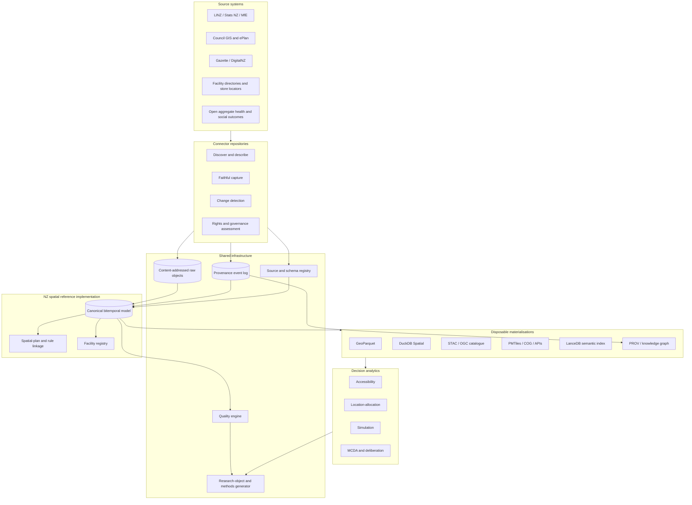

# Design

## 1. Ecosystem architecture



## 2. Responsibility split

- **Connector repositories** own source-specific network access, rate limits, authentication, raw response capture and change detection.
- **Archive repositories** own schedules, snapshot assembly, distribution and retention.
- **Shared provenance core** owns event semantics, validation, adapters and methods/research-object generation.
- **Domain schema packages** own canonical meaning and migrations.
- **Materialisation adapters** own physical output formats and query examples.
- **Applied repositories** own research questions, model choices, outcome interpretation and manuscripts.

## 3. Source of truth

The source of truth is a tuple:

1. immutable source objects or trustworthy external preservation references;
2. append-only provenance events;
3. versioned schemas and classifications;
4. versioned transformation code and environment identity;
5. signed snapshot manifest.

No database file, graph, search index or dashboard is independently authoritative.

## 4. Event-to-graph pattern

Operational systems append compact events. A deterministic projector emits:

- W3C PROV-compatible JSON-LD/RDF;
- OpenLineage run events;
- relational lineage tables in DuckDB;
- optional property-graph views;
- RO-Crate workflow/run entities.

This avoids coupling every connector to a graph database while retaining rich cross-repository queries.

## 5. Bitemporal spatial/legal model

Every changeable spatial/legal entity can carry:

- `valid_from` / `valid_to`: when the state applies in the represented world or legal system;
- `recorded_from` / `recorded_to`: when the infrastructure knew or stored that state;
- `published_at`: source publication time;
- `retrieved_at`: capture time;
- `operative_at`: legal/effective time when known;
- `superseded_at`: replacement time when known.

Unknown dates remain null with a reason; retrieval time is never silently substituted for legal validity.

## 6. Snapshot and materialisation model

A logical snapshot identifies canonical entities and evidence. One snapshot may have many materialisations. Each materialisation declares:

- format and media type;
- exact producing transformation;
- parent snapshot;
- schema and partitioning;
- digest and size;
- intended use and known fidelity losses.

## 7. Release object

A release bundle contains at minimum:

```text
ro-crate-metadata.json
snapshot-manifest.json
provenance.jsonld
openlineage/
quality-report.json
methods.md
methods.json
CITATION.cff
datacite.json
checksums.sha256
sbom.cdx.json
attestations/
data/ or resolvable content references
```

## 8. Scaling path

1. Validate the profile with existing `fyi-cli` and `fyi-archive` evidence.
2. Build three heterogeneous NZ spatial connectors.
3. Publish a small, complete research object.
4. Scale council coverage and temporal history.
5. Add facility registry and outcome linkage.
6. Add optimisation/simulation engines only after data quality and feasibility constraints are explicit.
