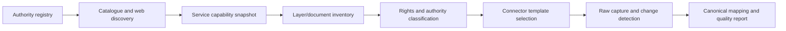

# New Zealand Spatial Archive — Initial Source Register

**Status:** discovery baseline. Inclusion in this table does not mean redistribution is automatically permitted. Every layer/dataset receives a versioned source record and rights review.

## National authoritative and official sources

| Source family | Candidate content | Access pattern | Temporal opportunity | Initial action |
|---|---|---|---|---|
| LINZ Data Service | addresses, roads, property/boundaries, place names, topography, elevation and imagery metadata | Koordinates portal, WFS/WMTS/CS-W, APIs, bulk exports; API key required for services | changeset service for updated datasets; source metadata snapshots | build catalog and changeset-capable connector |
| Stats NZ Geographic Data Service | statistical boundaries and selected census spatial datasets | Koordinates portal/API/web services | annual/census boundary editions and metadata | build boundary/version connector and concordance registry |
| Ministry for the Environment data services | environmental layers and national planning-standard material | open-data portal/services plus documents | source publication versions | source-register connector; preserve standards documents |
| National Planning Standards | zone framework, spatial-layer terminology, plan structure/electronic-accessibility requirements | official document/PDF/DOCX | amendment/version history | encode a crosswalk vocabulary, not a claim of identical council semantics |
| New Zealand Gazette | official notices, including land and secondary-legislation notices | web search; DigitalNZ API; restricted RSS key route | notices from 2000 online; publication dates and identifiers | use existing/future DigitalNZ connector and preserve notice identifiers |
| New Zealand Legislation | Acts, regulations and related text | official web documents and existing corpus tooling | versions and commencement information where supplied | integrate `corpus-legislation-nz` and `nlp-policy-nz` provenance |
| data.govt.nz | discovery catalogue | API/catalogue | dataset metadata changes | use for discovery, not as evidence that the linked data are current |

## Council planning sources

There is no assumption of one national live council-zoning layer. The programme will inventory each authority and classify publication mechanisms:

1. ArcGIS Online/Enterprise feature services and REST service directories.
2. OGC WFS/WMS or Koordinates data portals.
3. ePlan viewers with documented export or service endpoints.
4. Static shapefile, geodatabase, GeoJSON or PDF downloads.
5. Plan text in HTML/PDF and associated schedules/maps.
6. Metadata/catalogue pages without downloadable geometry.

For each authority, the source registry records:

- territorial/regional authority identity and changing boundaries;
- current and historical plan names/status;
- viewer/catalogue URLs and discovered service endpoints;
- layer/item IDs, service definitions and field schemas;
- source-reported update timestamps;
- licence/terms and attribution;
- whether the layer is informational, indicative or identified as part of the statutory plan;
- links to plan documents, schedules, decisions, appeals and Gazette evidence where relevant;
- connector health and last successful capture.

## Pilot council selection

Select at least four councils to exercise heterogeneous mechanisms, not merely the easiest four. Proposed selection criteria:

- one large metropolitan unitary authority;
- one regional growth centre;
- one predominantly rural territorial authority;
- one council with a different ePlan/GIS technology;
- explicit, usable publication terms;
- available zone and overlay layers plus plan text.

The exact councils are chosen only after automated endpoint discovery and rights review.

## Facility sources

### Supermarkets

Candidate sources include retailer store finders, OpenStreetMap, council food-premises/open-business registers where available, NZBN-linked organisation data and manually verified public pages. Each has different completeness, temporal and licence characteristics. The facility registry retains source records and match evidence rather than creating an unexplained “master list”.

### Health facilities

- public/open facility directories where available;
- `healthpoint-rs` for licensed Healthpoint access, with redistribution policy preserved;
- Ministry/Health NZ public service and hospital directories;
- emergency-service data only where legally and operationally suitable.

## Population and health outcomes

Initial work uses publicly available aggregate data:

- Stats NZ population, demographic and boundary data;
- official deprivation or socioeconomic indices under their stated terms;
- public Ministry of Health/Health NZ and environmental-health indicators;
- road network, public transport and travel-time inputs with source-specific licences.

Any unit-record or sensitive data use is a separate controlled-data track.

## Discovery pipeline

## Temporal backfill strategy

- current-state capture starts immediately and becomes prospective history;
- query service metadata and item histories where exposed;
- locate archived downloads, plan amendments and historical plan documents;
- use the New Zealand Web Archive or other lawful preserved copies where accessible;
- distinguish reconstructed historical state from contemporaneously captured state;
- never assign an operative date based only on file modification time.
